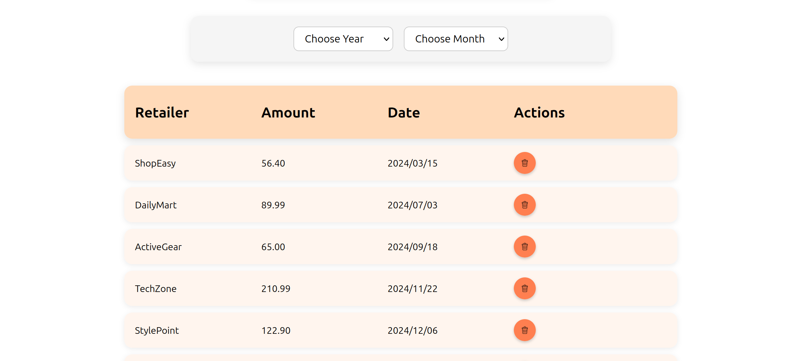
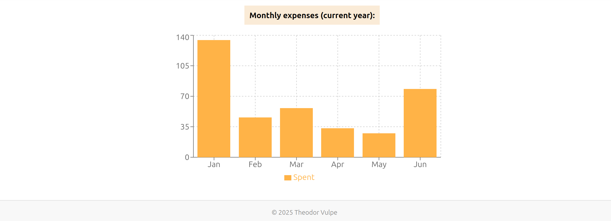
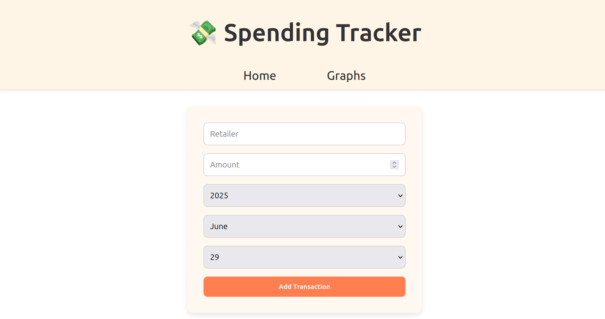

# 💸 Spending Tracker

A simple **React** app to manage your expenses. You can add, delete, and filter transactions, and view a chart showing your spending over the current year.

🔗 [Live Demo](https://spending-tracker-green.vercel.app/)

---

## 📸 Screenshots

### 💼 Transaction List

### 📊 Spending Chart

### ➕ Add Transaction

---

## 🛠️ Technologies Used

- **React**
- **CSS** – custom styling

---

## ✨ Features

- ➕ Add new transactions with amount, retailer, and date
- 🗑️ Delete existing transactions
- 📅 Filter transactions by **year** and **month**
- 📊 Visualize **spending chart** for the current year
- 🔒 Authentication

---

## 🧑‍💻 Author

Built by Theodor Vulpe - CS student @ UPB

---

## 🪪 License

This project is open-source and available under the MIT License.
